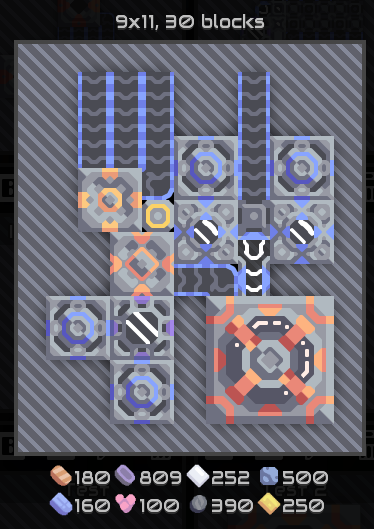
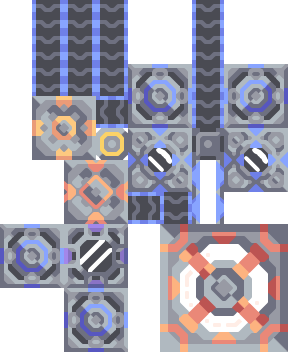

# Mindustry Schematic Deserializer

A C# (.NET Core) implementation of Mindustry's schematics, allowing you to deserialize and thender them to a .png.

`MindustrySchematics.Deserializer.ConsoleApp` has example code on how to use it.

## Done

- Deserialize schematics from base64
- Render schematics to .png

## To do

- Render conveyor/liquid bridge connections
- Render power node connections
- Render proper conveyor connections (intersections, T-sections, etc.)
- Calculate required resources

## Example

In-Game schematic/Rendered schematic  

